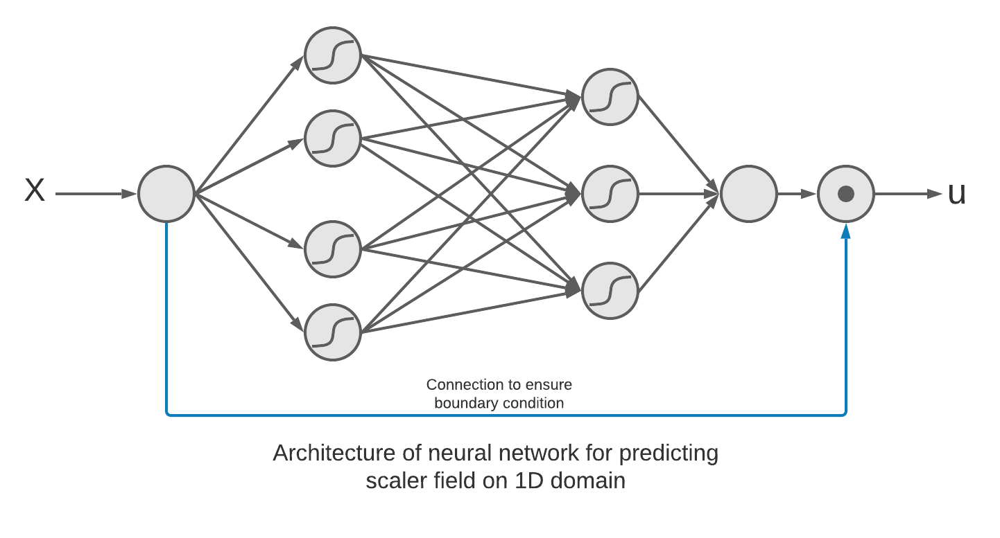

# Physics Informed Neural Network (PINN)
**Backgroud:**

The term "neural network" encompasses a wide range of machine learing models with one similarity i.e., so called "neurons" as the basic building block. The variety in the family of neural network models can be in the form of their architecture (arrangement of neurons and layers), learning process (supervised or unsupervised), purpose of the model (regression or classification) and so on. Physics informed neural network is yet another variant in this family of neural networks. Currently in its infancy, PINN can potentially disrupt the way differential equations are presently solved in the field of engineering.

Diffrential equations lie at the core of engineering. Irrespective of the engineering subdomain, diffrential equations appear in one form or the other. Often one needs to numerically solve such equations on the domain of interest. For example, one needs to solve the  in order to obtain the stress and strain distribution in a tensile test. The current state of the art of technique is using finite element technique to solve such equations. Physics informed neural network aims at solving the diffrential equations using a meshless technique.

**Physics Informed Neural Network:**
The prefix "Physics Informed" comes from the fact that the loss used to train the neural network is obtained using physics of the diffrential equation being solved. The model is said to be trained using unsupervised learning as there is no target variable to compute the loss, rather the loss is the function of the output inputs and outputs of the neural network model itself. Let's try to understand this approach using a standard problem from the domain of mechanics.

**Formulation of Physics Informed Neural Network:**
Let's solve the following diffrential equation under the given boundary condition using physics informed neural network:

  
 

such that

  

The analytical solution to the above equation can easily be derived and turns out to be the following:

  

The procedure for numerically solving the given diffrential equation using physics informed neural network is as follows:

**Preparation of the dataset**

    1. Identify the domain on which the diffrential equation is to be solved.
    2. Discretize the domain into a set of nodes
    3. Compute the weights corresponding to the nodes for carrying out numerical integration.

**Initialization of neural network**

    1. Decide the neural network architecture. Since the domain is one-dimensional, there is only one node in the input layer.
    2. Since the output is a scaler quantity, the number of nodes in the output layer is 1.
    3. Decide the number of hidden layers, corresponding number of nodes, activation values etc.
    4. Possibly design the architecture in such a way that boundary conditions are implicitly satisfied.
    
 **Defination of loss for training the neural network**
 
    1. Set the functional of the differential equation as the loss of the neural network.
  
 **Training the neural network**
 
 

  

1. Solves differential equations
2. Neural network with unsupervised learning
3. Uses the knowledge of underlying physic
4. Exploits auto-differentiation technique to calcuate loss of the neural network model
